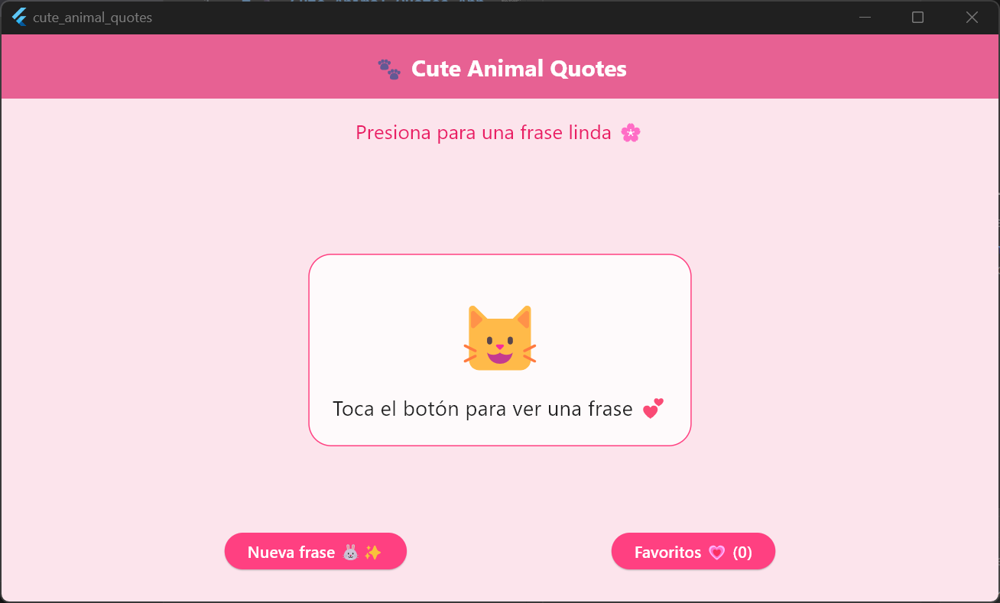
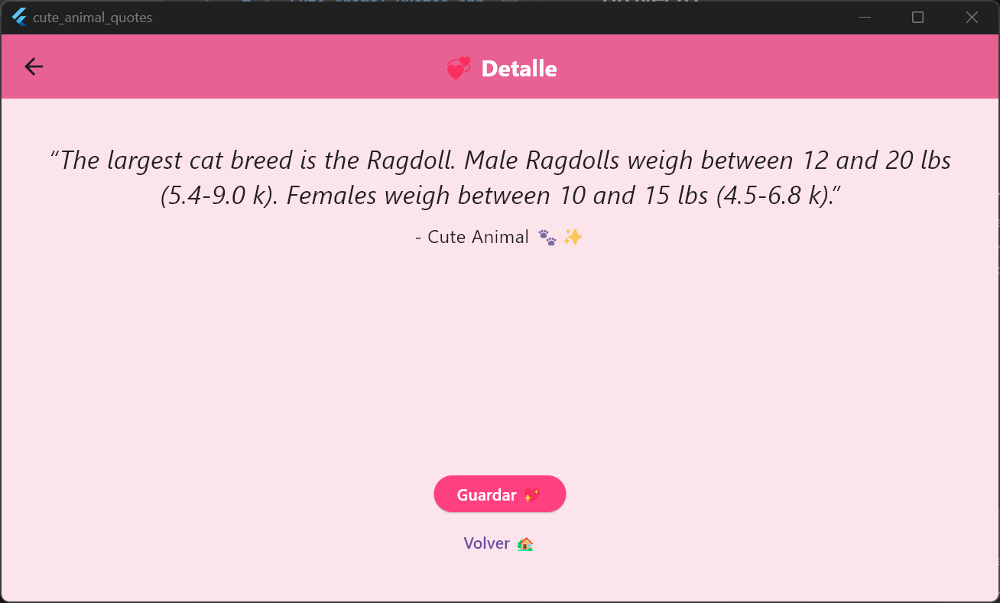
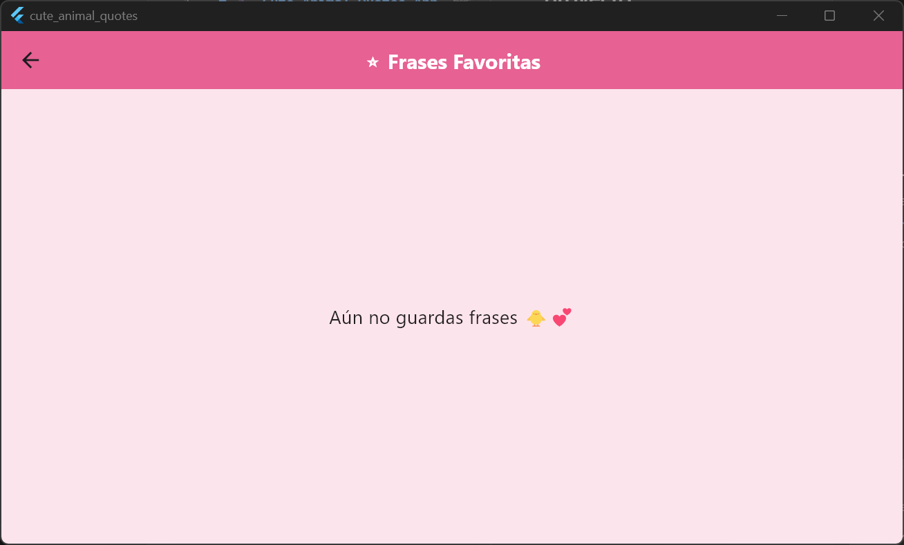
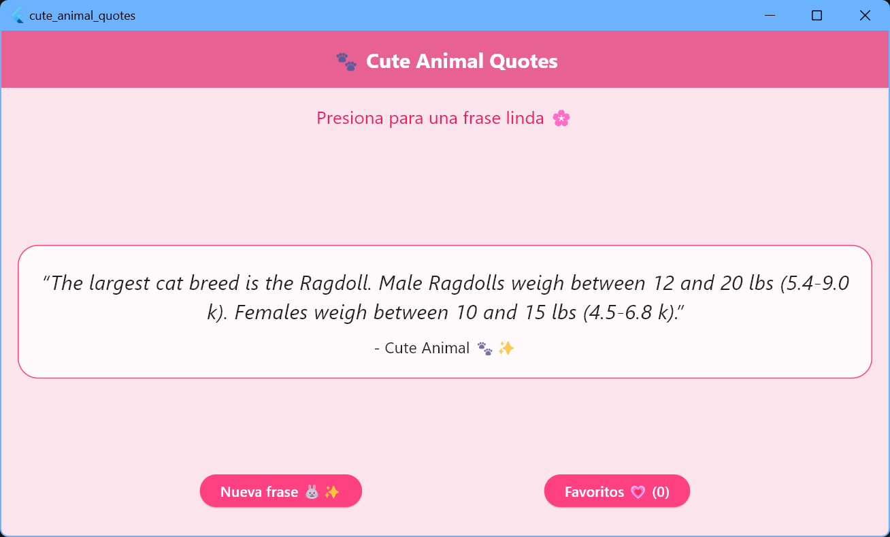
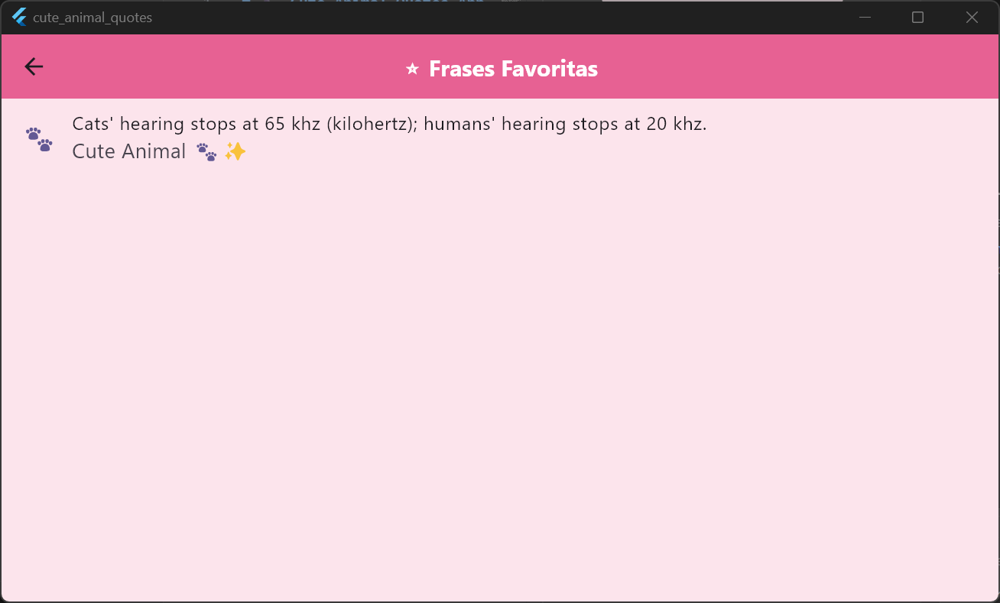

# 🐾 Cute Animal Quotes App

## 🧩 Descripción
Aplicación móvil desarrollada en Flutter que muestra frases curiosas y adorables de animales obtenidas desde una API externa. La aplicación permite a los usuarios visualizar nuevas frases y guardarlas en una lista de favoritos.

## 🚀 Funcionalidades
- Obtener frases aleatorias desde una API (Cat Facts)
- Visualizar frases en una interfaz amigable
- Navegación entre pantallas (inicio, detalle, favoritos)
- Guardar frases como favoritas
- Visualizar lista de frases guardadas

## 🛠️ Tecnologías utilizadas
- Flutter
- Dart
- HTTP (consumo de API REST)
- Material Design

## 🌐 API utilizada
- https://catfact.ninja/fact

## 📱 Capturas de pantalla
(Aquí puedes agregar imágenes de la app)

## ▶️ Cómo ejecutar el proyecto
1. Clonar el repositorio:
   ```bash
   git clone https://github.com/tu-usuario/cute-animal-quotes-app.git
   ```

2. Abrir el proyecto en Android Studio o VS Code
3. Ejecutar en un emulador o dispositivo físico

## 👩‍💻 Autor
Karito Dianeth Medina Chocce

## 📌 Estado del proyecto
Proyecto académico / portafolio personal

---

## 📸 Capturas







---
